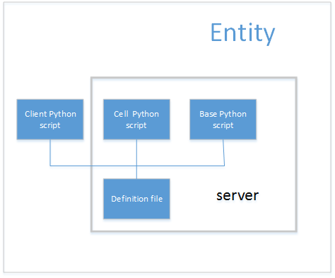

## 2. Entity脚本文件组织结构

Entity是组成游戏世界的对象。可以使用entity来创建玩家，NPC，战利品你，聊天室和其它交互元素。  
每个entity类型由python脚本脚本的集合实现，基于一个XML定义文件绑定在一起。脚本位于Scripts目录的资源树中（i.e,`<res>/Scripts`,`<res>`是定义在环境变量中的虚拟路径，一般命名为assets目录。）。  

### 2.1. KBEngine引擎默认资产库（额外加入这一小节）
KBEngine引擎默认资产库`<assets>`目录，如果用户没有设置环境变量指向，引擎默认会尝试读取引擎根目录assets作为默认的资产库。资产库的概念类似于Unity3D中的Assets，不过其中一些文件夹名称结构被固定了。  
要想引擎启动时读取到对应的项目资产库，必须在环境变量中指定。  
下表总结了`<res>`中entity的重要文件和目录:

### 2.2. entity.xml文件介绍
**kbe还能指定是否有客户端脚本**  
`<res>/scripts/entities.xml`文件被引擎用来确定可用的entity类型。  
这个文件的每个标签描述一种entity类型，同时要求在`<res>/scripts/defs`目录中必须有相应的定义文件，在`<res>/scripts/base`或者`<res>/scripts/cell`至少存在一个python脚本文件。可能在`<res>/entities/client`也存在脚本文件。  
定义在此文件中的entity类型的顺序对应entity的类型ID。最简单的形式是，entity文件有一个标签列表来加载每一个entity。  

定义一个名为NewEntityType的entity，如下在entities.xml中简单的增加一行即可：
```xml
<root>
    ...
    <NewEntityType/>
</root>
```

### 2.3. definition文件
`<res>/entities/defs/<entity>.def`文件确定你的脚本在KBE中如何关联。这个机制允许KBE系统把发送和接收消息的任务抽象成简单的调用entity的不同脚本方法。某种意义上，definition文件提供了entity的接口，而在python脚本中具体实现。下图展示了kbe entity的概念部分：  
  

每个entity类型有一个对应的定义文件，命名为entity名，后缀为`.def`。例如，一个Avatar entity类型会有一个叫做`Avatar.def`的文件。  
以下是一个新entity的最小定义文件，用于说明本章节想要表达的内容：  
```
<root>
	<Parent> optional parent entity </Parent>

	<Implements>
		<!-- interface references -->
	</Implements>

	<ClientName> optional client type </ClientName>

	<Volatile>
		<!-- volatile definitions -->
	</Volatile>

	<Properties>
		<!-- properties -->
	</Properties>

	<ClientMethods>
		<!-- declaration -->
	</ClientMethods>

	<CellMethods>
		<!-- declaration -->
	</CellMethods>

	<BaseMethods>
		<!-- declaration -->
	</BaseMethods>

	<LoDLevels>
		<!-- levels of detail -->
	</LoDLevels>
</root>
```
接下来我们将学习到使用实际的代码替换上述def文件例子中的注释(`<!-- -->`)说明。

2.4. 脚本文件
KBE技术把在游戏世界中的entity划分为3个不同的部分，也就是3个不同的执行上下文(execution contexts):  


Entity 类型 | 脚本文件位置 | 描述
- | - | -
Cell | `<res>/entities/cell` | 负责实体影响其周围空间的部分.  
Base | `<res>/entities/base` | 负责entity不影响周围空间的部分 (以及表现为玩家proxy). 相关处理发生在服务器集群上。
Client | `<res>/entities/client` | 负责对周围环境需要重度感知的实体部分。

有些entity实例只具有3个部分中的一个也是可以的。此外，有些entity类型可能不支持具有这些部分中的一个。对每个entity类型而言，如果这类型支持对应的可执行上线文的话，在CellApp、BaseApp、Client都会有一个对应的脚本文件。  
这些脚本文件以entity类型名加`.py`扩展名命名。这个文件必须包含一个名字为entity类型名的类。  
例如，如果你有一个entity类型`Avatar`，它拥有cell,base和client的处理上下文，将会有3个脚本文件，每一个都有相关类的实现: 

* `<res>/entities/cell/Avatar.py`
* `<res>/entities/base/Avatar.py`
* `<res>/entities/client/Avatar.py`  

The entityʹs base class defined in the script file is determined by the execution context that
the file represents, as described below:
定义在脚本文件中的entity基类有其所在的执行上下文确定，描述如下：

脚本文件执行上下文 | entity基类
- | -
Cell | KBEngine.Entity
Base | KBEngine.Base或BigWorld.Proxy
Client | KBEngine.Entity或自定义的协议

关于Client，如果KBE提供了python执行上下文的客户端，那么是BigWorld.Entity，否则可以自己对接KBE引擎，实现自己的Entity脚本体系，可以参照KBE的unity插件。  
更多关于Base和Proxy基类的细节，请查看章节`<Proxies和Players>`。

例如一个Seat entity脚本实现可以开始如下：

* Cell脚本文件`<res>/entities/cell/Seat.py`
```
import KBEngine

class Seat( KBEngine.Entity ):
	def __init__( self ):
		KBEngine.Entity.__init__( self )
```

* Base脚本文件`<res>/entities/base/Seat.py`
```
import KBEngine

class Seat( KBEngine.Base ):
	def __init__( self ):
		KBEngine.Base.__init__( self )
```

* Client脚本文件
```
```
