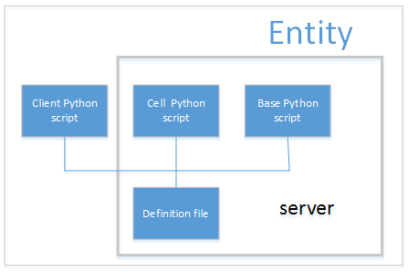

## 2. Entity脚本文件组织结构

Entity是组成游戏世界的对象。可以使用entity来创建玩家，NPC，战利品你，聊天室和其它交互元素。  
每个entity类型由python脚本脚本的集合实现，基于一个XML定义文件绑定在一起。脚本位于Scripts目录的资源树中（i.e,`<res>/Scripts`,`<res>`是定义在环境变量中的虚拟路径，一般命名为assets目录。）。  

### 2.1. KBEngine引擎默认资产库（额外加入这一小节）
KBEngine引擎默认资产库`<assets>`目录，如果用户没有设置环境变量指向，引擎默认会尝试读取引擎根目录assets作为默认的资产库。资产库的概念类似于Unity3D中的Assets，不过其中一些文件夹名称结构被固定了。  
要想引擎启动时读取到对应的项目资产库，必须在环境变量中指定。  
下表总结了`<res>`中entity的重要文件和目录:

### 2.2. entity.xml文件介绍
**kbe还能指定是否有客户端脚本**  
`<res>/scripts/entities.xml`文件被引擎用来确定可用的entity类型。  
这个文件的每个标签描述一种entity类型，同时要求在`<res>/scripts/defs`目录中必须有相应的定义文件，在`<res>/scripts/base`或者`<res>/scripts/cell`至少存在一个python脚本文件。可能在`<res>/entities/client`也存在脚本文件。  
定义在此文件中的entity类型的顺序对应entity的类型ID。最简单的形式是，entity文件有一个标签列表来加载每一个entity。  

定义一个名为NewEntityType的entity，如下在entities.xml中简单的增加一行即可：
```xml
<root>
    ...
    <NewEntityType/>
</root>
```

### 2.3. definition文件
`<res>/entities/defs/<entity>.def`文件确定你的脚本在KBE中如何关联。这个机制允许KBE系统把发送和接收消息的任务抽象成简单的调用entity的不同脚本方法。某种意义上，definition文件提供了entity的接口，而在python脚本中具体实现。下图展示了kbe entity的概念部分：  
  

Each entity type has a corresponding definition file, named after the entityʹs type name
followed by the extension ʹ.defʹ. For example, a Seat entity type would have a file called
Seat.def.
It is useful then, to have a ʹminimalʹ definition file to aid in quickly defining a new entity, as
well as to assist in explaining what the documentʹs section is trying to accomplish.
The following file is a minimal entity definition file:

  
By the end of this chapter, we should be able to replace all placeholders (denoted by italics)
in the example file above with actual code.

