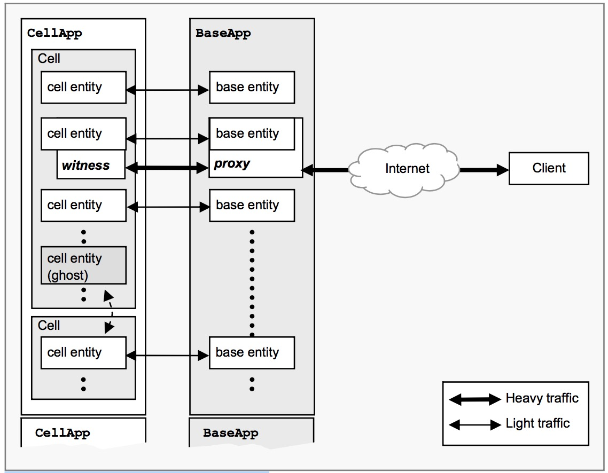

## 8. Proxies和玩家

### 8.1. Proxies
BaseApp上的KBEngine.Proxy继承于KBEngine.Base，目的是为玩家控制entity提供支持。从KBEngine.Proxy继承的entity，能够实现玩家角色，玩家账号和服务器任何其他玩家控制对象相关。  
无论何时一个客户端登录到服务器，一个从KBEngine.Proxy衍生的entity会从数据库被创建。KBE如何确定加载哪个Proxy的细节，请看`User Authentication And Proxy Selection`章节。以这个方式创建的Proxies会有一个叫做`password`的属性，这个属性的值会被设置为登录密码。  
一个KBEngine.Proxy实例既不需要cell entity或者客户端。和其他entity一样，一个proxy entity能够使用KBEngine.createBase来创建。详细请看BaseAPp的`Entity Instantiation and Destruction`章节。  

和其它Base entity一样，保存entity到数据库和从其中加载entity都是可以的。开始时，这些从新加载的proxy entity是没有客户端依附的。接着，一个已经存在的proxy可以把它的客户端转交给重载的proxy，重载的entity将负责处理这个客户端连接。  
这个可以实现功能，例如，玩家登陆时连接到Account proxy，然后从菜单选择另一个proxy来作为游戏中的角色。把控制权转角给另一个proxy使用方法giveClientTo，例子如下：  
`clientControlledProxy.giveClientTo( nonClientControlledProxy )`  
注意，两个proxy必须在相同的BaseApp。   
无论何时客户端在两个proxy之间转换，客户端衣服的cell entity会被销毁，客户端会接收到一个onEntitiesReset调用去清理它的当前的世界数据（knowledge of the world）。这会很快中断所有的游戏通信同时强制客户端刷新。如果只是cell entity被销毁，proxy的客户端数据还会被保持下来。
  
